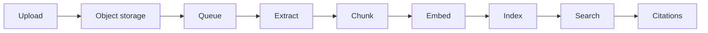
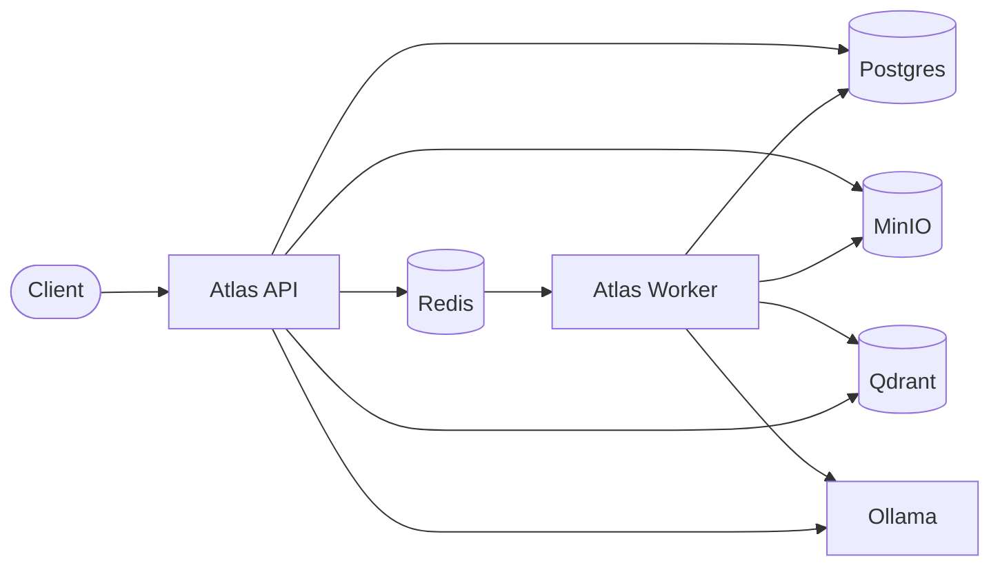
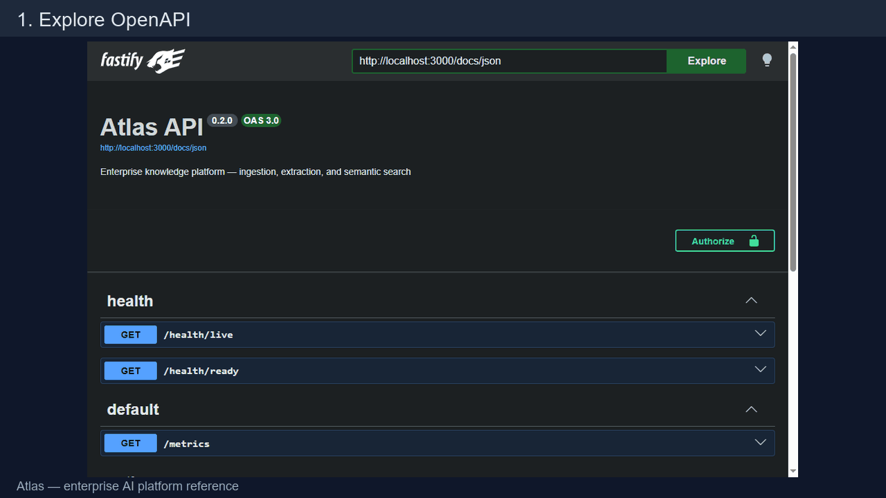
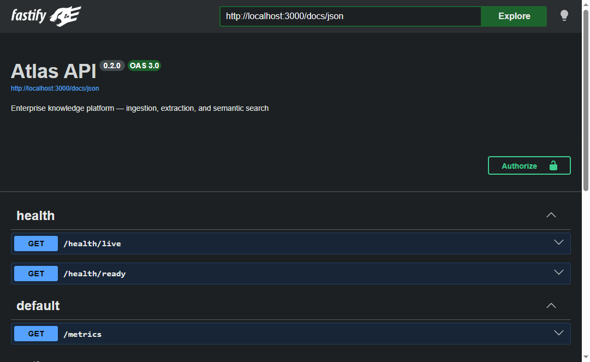
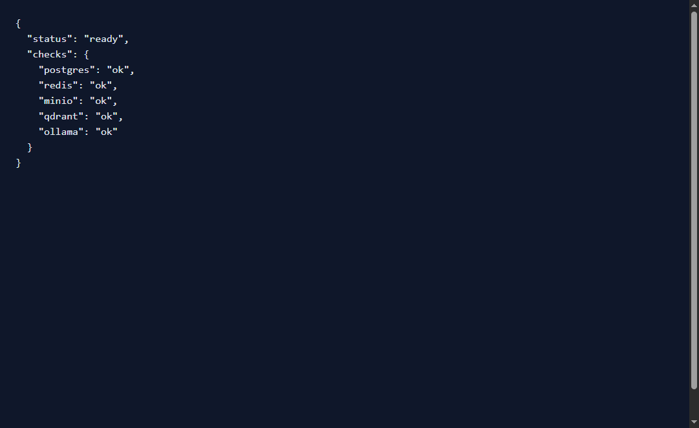
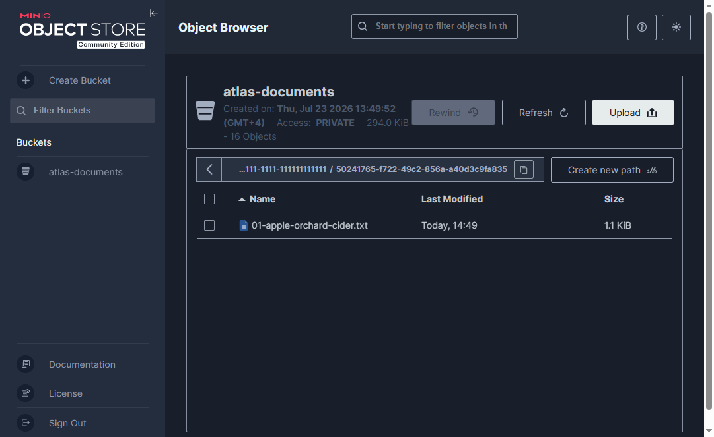
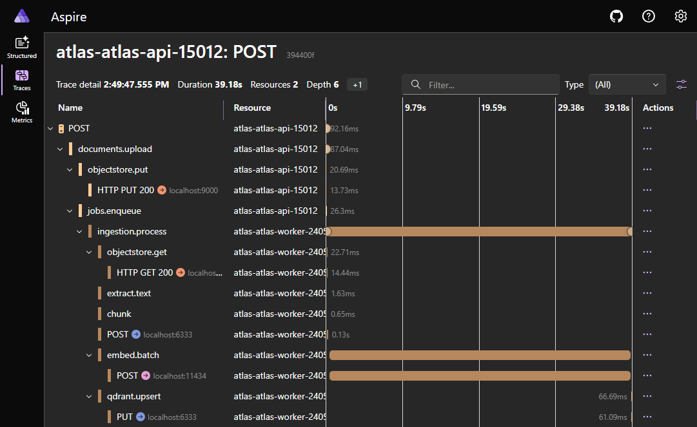
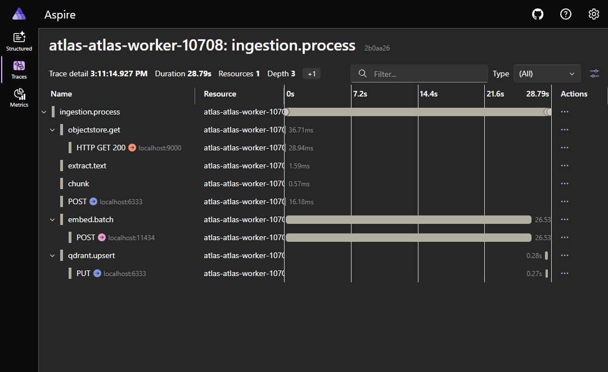
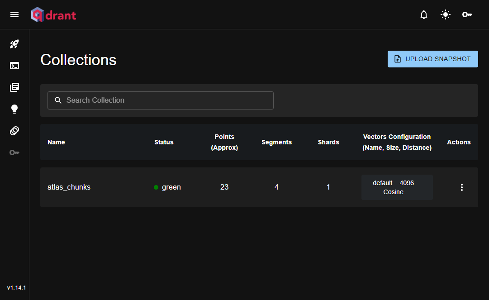

# Atlas

[](./package.json)
[](./tsconfig.base.json)
[](./pnpm-workspace.yaml)
[](./docs/adr/0003-opentelemetry-w3c-over-vendor-sdks.md)
[](./docs/architecture/overview.md)
[](./docs/README.md)

**Production-grade AI platform for LLM applications.**

Atlas is a reference implementation of an enterprise knowledge platform: hexagonal architecture, asynchronous document ingestion, tenant isolation, object storage, vector search with citations, and OpenTelemetry instrumentation.

---

## What you get



| Concern | How Atlas handles it |
|---------|----------------------|
| **Architecture** | Hexagonal ports & adapters, vertical slices, pnpm monorepo |
| **Ingestion** | Async BullMQ jobs, retries, DLQ, idempotent reindex |
| **Storage** | MinIO/S3 for bytes; Postgres for metadata & citations; Qdrant for vectors |
| **Embeddings** | Local Ollama (`qwen3-embedding`) behind an `EmbeddingProvider` port |
| **Retrieval** | Tenant-filtered semantic search with chunk citations |
| **Tenancy** | JWT `tenantId` only — never from request bodies |
| **Observability** | OTel traces/metrics/logs + Prometheus + Aspire Dashboard |
| **Ops** | Health probes, OpenAPI, Compose fallback, optional Aspire control plane |

---

## Feature matrix

| Capability | Status | Notes |
|------------|--------|--------|
| Authenticated upload API | ✅ | Multipart, ≤50MB, `Idempotency-Key` |
| Async ingestion pipeline | ✅ | BullMQ + DLQ + optimistic state machine |
| Object storage (S3 API) | ✅ | MinIO locally; swap via port |
| PDF + text extraction | ✅ | Line/page repair for PDFs |
| Chunking with overlap | ✅ | Word-boundary, configurable size |
| Vector indexing (Qdrant) | ✅ | Cosine, tenant payload filter |
| Semantic search + citations | ✅ | Hydrated chunk text from Postgres |
| Multi-tenant isolation | ✅ | JWT-scoped API, DB, and Qdrant |
| OpenAPI / Swagger UI | ✅ | `/docs` |
| Liveness / readiness | ✅ | Postgres, Redis, MinIO, Qdrant, Ollama |
| Prometheus metrics | ✅ | `/metrics` |
| OpenTelemetry (OTLP) | ✅ | Trace continuity across API → queue → worker |
| Aspire AppHost | ✅ | Control plane only — never imported by domain |
| Hybrid BM25 + vector | 🗺️ | Roadmap |
| Cross-encoder rerank | 🗺️ | Roadmap |
| Conversational RAG / streaming answers | 🗺️ | Roadmap |
| Semantic cache | 🗺️ | Roadmap |
| Retrieval debugger | 🗺️ | Roadmap |
| OIDC / SSO | 🗺️ | Roadmap |
| Automated IR evaluation suite | 🗺️ | Fixtures exist; harness planned |

Legend: ✅ shipped · 🗺️ planned

---

## Architecture at a glance



**Dependency rule:** `packages/domain` never imports `packages/infra`. Adapters implement ports; apps compose them.

Deep dive: [Architecture overview](./docs/architecture/overview.md) · [AI pipeline](./docs/architecture/ai-pipeline.md) · [Sequence diagrams](./docs/architecture/sequence-diagrams.md) · [Deployment](./docs/architecture/deployment.md)

---

## Repository layout

```text
atlas/
├── apphost/                 # Aspire AppHost (control plane ONLY)
├── apps/
│   ├── api/                 # Fastify REST + OpenAPI
│   └── worker/              # BullMQ ingestion consumer
├── packages/
│   ├── domain/              # Entities, ports, chunker, state machine
│   ├── infra/               # Prisma, MinIO, BullMQ, Ollama, Qdrant
│   ├── config/              # Zod-validated environment
│   ├── observability/       # Pino + Prometheus + OpenTelemetry
│   └── test-utils/
├── docs/                    # Engineering handbook
│   ├── architecture/
│   ├── engineering/
│   ├── adr/
│   ├── benchmark/
│   ├── evaluation/
│   ├── security/
│   ├── performance/
│   └── contributing/
├── fixtures/seed-docs/      # Polysemy search-eval documents
├── scripts/                 # happy-path + seed helpers
└── docker-compose.yml
```

---

## Quick start

### Prerequisites

| Tool | Version |
|------|---------|
| Node.js | 20+ (`.nvmrc`) |
| pnpm | 9+ (`corepack enable`) |
| Docker Compose | recent |
| [Ollama](https://ollama.com) | host process (not in Compose) |

```bash
ollama pull qwen3-embedding
```

### Option A — Docker Compose + pnpm

```bash
git clone https://github.com/EBay1992/atlas.git
cd atlas
cp .env.example .env

pnpm install
docker compose up -d postgres redis minio minio-init qdrant

pnpm db:generate && pnpm db:migrate && pnpm db:seed

pnpm --filter @atlas/config build \
 && pnpm --filter @atlas/domain build \
 && pnpm --filter @atlas/observability build \
 && pnpm --filter @atlas/infra build

pnpm dev:api      # terminal 1
pnpm dev:worker   # terminal 2
```

### Option B — Aspire AppHost (recommended local control plane)

```bash
cp .env.example .env
pnpm install
pnpm --filter @atlas/config build \
 && pnpm --filter @atlas/domain build \
 && pnpm --filter @atlas/observability build \
 && pnpm --filter @atlas/infra build

pnpm aspire:restore
pnpm aspire:run
```

Details: [`apphost/README.md`](./apphost/README.md) · [ADR 0002](./docs/adr/0002-aspire-as-control-plane-not-framework.md)

### Observability

```bash
docker compose --profile observability up -d aspire-dashboard
```

```bash
# .env
OTEL_ENABLED=true
OTEL_EXPORTER_OTLP_ENDPOINT=http://localhost:4318
```

| Signal | What to look for |
|--------|------------------|
| **Traces** | `documents.upload` → `jobs.enqueue` → `ingestion.process` (extract / chunk / embed / qdrant) |
| **Correlation** | `correlationId === documentId` across retries |
| **Manual retry** | New Trace ID + span **link** to the original upload |

See [Observability guide](./docs/architecture/observability.md).

### Seeded credentials (lab only)

| Field | Value |
|-------|--------|
| Email | `admin@acme.local` |
| Password | `atlas-dev-password` |

Change before any shared deploy. [Security](./SECURITY.md)

---

## End-to-end demo

```bash
TOKEN=$(curl -s -X POST http://localhost:3000/v1/auth/login \
  -H 'content-type: application/json' \
  -d '{"email":"admin@acme.local","password":"atlas-dev-password"}' \
  | jq -r .accessToken)

curl -s -X POST http://localhost:3000/v1/documents \
  -H "authorization: Bearer $TOKEN" \
  -H "idempotency-key: demo-1" \
  -F file=@fixtures/seed-docs/01-apple-orchard-cider.txt | jq

curl -s -X POST http://localhost:3000/v1/search \
  -H "authorization: Bearer $TOKEN" \
  -H 'content-type: application/json' \
  -d '{"query":"heirloom cider orchard","limit":5}' | jq
```

Or: `bash scripts/happy-path.sh`

| URL | Purpose |
|-----|---------|
| http://localhost:3000/docs | OpenAPI UI |
| http://localhost:3000/health/ready | Dependency readiness |
| http://localhost:3000/metrics | Prometheus |
| http://localhost:18888 | Aspire Dashboard (observability profile) |
| http://localhost:9001 | MinIO console |
| http://localhost:6333/dashboard | Qdrant dashboard |

> **Screenshots** — live captures live in [`docs/architecture/assets/`](./docs/architecture/assets/README.md).















---

## Documentation

| Section | Purpose |
|---------|---------|
| [docs/](./docs/README.md) | Engineering handbook index |
| [Architecture](./docs/architecture/overview.md) | System design, boundaries, diagrams |
| [AI pipeline](./docs/architecture/ai-pipeline.md) | Ingest → embed → retrieve |
| [ADRs](./docs/adr/README.md) | Why we chose what we chose |
| [Engineering](./docs/engineering/monorepo.md) | Monorepo, testing, standards |
| [Evaluation](./docs/evaluation/README.md) | Search quality fixtures & future harness |
| [Benchmark](./docs/benchmark/README.md) | Latency / throughput targets |
| [Security](./docs/security/overview.md) | Tenancy, secrets, hardening |
| [Contributing](./docs/contributing/README.md) | How to change Atlas safely |

---

## Benchmarks & evaluation

| Command | Intent | Status |
|---------|--------|--------|
| `pnpm test` | Unit + package tests | ✅ |
| Integration Vitest | API + worker happy path | ✅ (stack required) |
| `pnpm run benchmark` | Latency, embed & queue throughput | 🗺️ |
| `pnpm run evaluate` | Precision, Recall, MRR, Hit Rate | 🗺️ |

Polysemy fixtures today: [`fixtures/seed-docs`](./fixtures/seed-docs) · `pnpm -w run seed:docs`

---

## Roadmap

Planned work, ordered by dependency:

| Phase | Focus |
|-------|--------|
| **1 — Foundation** | Documentation, ADRs, architecture diagrams |
| **2 — Cross-cutting APIs** | Observability helpers, worker factories, error mapping, Result types |
| **3 — Quality gates** | Architecture tests, benchmarks, IR evaluation, load tests |
| **4 — Retrieval quality** | Hybrid search, reranker, semantic cache, prompt versioning, retrieval debugger, cost tracking |
| **5 — Platform operations** | Live traces UI, MCP, model routing, circuit breakers, playground |

Record material decisions in [ADRs](./docs/adr/README.md). Prefer small, reviewable changes.

---

## Development

```bash
pnpm typecheck
pnpm build
pnpm --filter @atlas/domain test
pnpm --filter @atlas/api exec vitest run src/ingestion.integration.test.ts
```

Prisma: `pnpm db:generate` · `pnpm db:migrate` · `pnpm db:seed`

---

## License

See repository license (if present) or contact the maintainer. Contributions welcome — start with [Contributing](./docs/contributing/README.md).
