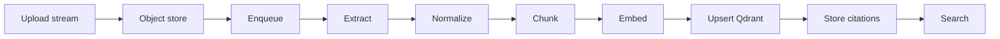

# AI pipeline

Atlas’s current AI surface is **ingestion + semantic retrieval** (not conversational generation). That is deliberate: get storage, tenancy, async reliability, and observability right before adding an answer LLM.

## Stages

| Stage | Where | Description |
|-------|--------|-------------|
| **Upload** | API | Multipart stream to S3; SHA-256; mint `documentId` / `jobId` |
| **Persist metadata** | API | Document + job rows; tenant from JWT |
| **Enqueue** | API | BullMQ payload with W3C `traceparent` + `correlationId` |
| **Extract** | Worker | PDF / text extractors |
| **Normalize** | Worker / domain | Repair whitespace / PDF artifacts |
| **Chunk** | Domain | Word-boundary windows with overlap |
| **Embed** | Worker → Ollama | Batched vectors (`EMBEDDING_DIMENSIONS`) |
| **Index** | Worker → Qdrant | Upsert points; payload includes `tenantId` |
| **Cite** | Worker → Postgres | Chunk text for human-readable hits |
| **Search** | API | Embed query → filter by tenant → hydrate citations |

## Idempotent reindex

Re-processing a document **deletes** prior Qdrant points and Postgres chunks for that document before writing new ones. Jobs move through an optimistic state machine: `queued → processing → completed|failed`.

## What is not in the pipeline (yet)

- LLM answer generation / token streaming  
- Hybrid BM25 + vector  
- Cross-encoder reranking  
- Prompt versioning / semantic cache  

Those belong to Phase 4+ of the [roadmap](../../README.md#roadmap). The ports (`EmbeddingProvider`, `VectorStore`) are the extension points.

## Configuration knobs

| Env | Effect |
|-----|--------|
| `CHUNK_SIZE` / `CHUNK_OVERLAP` | Chunker geometry |
| `OLLAMA_EMBEDDING_MODEL` | Embedding model id |
| `EMBEDDING_DIMENSIONS` | Must match model (4096 for `qwen3-embedding`) |
| `QDRANT_URL` | Vector endpoint |

## Evaluation hook

Polysemy fixtures under `fixtures/seed-docs/` stress sense disambiguation. Automated Precision / Recall / MRR is planned — see [Evaluation](../evaluation/README.md).

Example search hit from a live capture (`heirloom cider orchard` → orchard doc, not “Apple” the company):

Qdrant collection used by the pipeline (`atlas_chunks`, 4096-dim Cosine):

