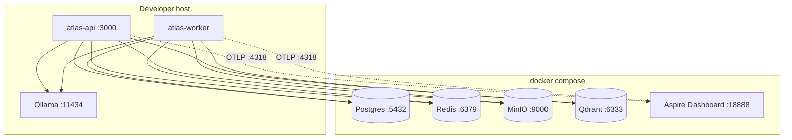
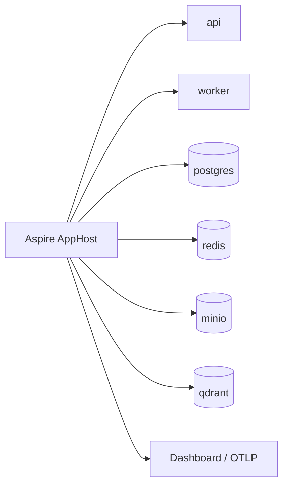

# Deployment diagram

Atlas supports two local orchestration paths. Application code does not depend on which path you pick.

## Docker Compose (fallback / CI)

Compose can also run API/worker as containers; then `OLLAMA_BASE_URL=http://host.docker.internal:11434` and service DNS names apply (see root README).

## Aspire AppHost (recommended control plane)

**Rule:** Aspire orchestrates processes and resources. It is **never** imported by `packages/domain` or `packages/infra` ([ADR 0002](../adr/0002-aspire-as-control-plane-not-framework.md), [ADR 0004](../adr/0004-compose-remains-fallback.md)).

## Production posture (intentional gaps)

The default stack is a **lab / reference** environment:

- No Kubernetes manifests or Helm charts yet  
- JWT demo auth (not OIDC)  
- Compose ports bound for developer convenience  

Hardening checklist: [Security overview](../security/overview.md) and root [SECURITY.md](../../SECURITY.md).
