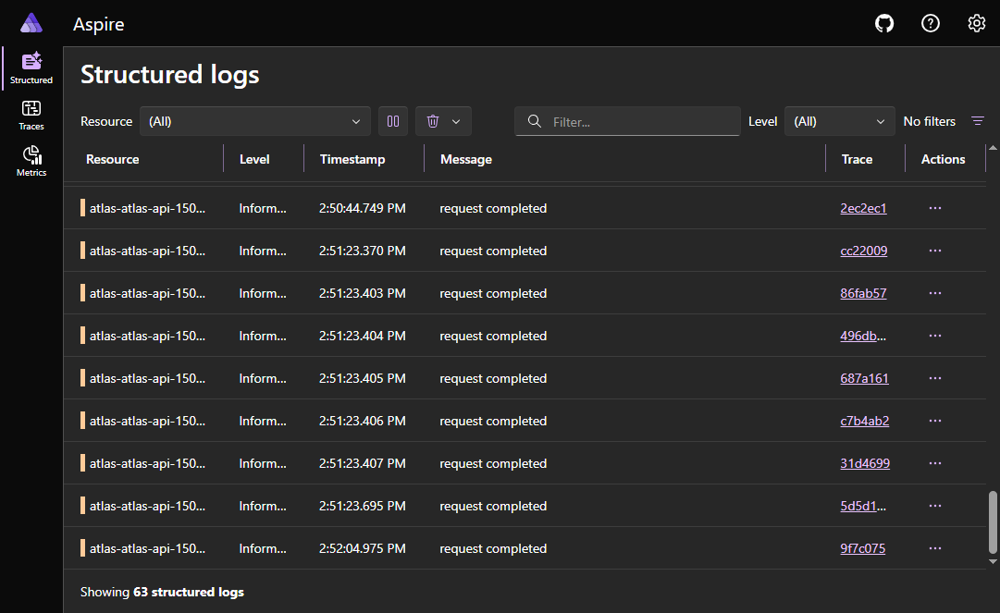

# Observability

Atlas treats telemetry as a first-class product concern.

## Stack

| Signal | Implementation | Export |
|--------|----------------|--------|
| Traces | OpenTelemetry SDK + `withSpan` helpers | OTLP → Aspire Dashboard / any collector |
| Metrics | `prom-client` + OTLP metrics | `/metrics` + OTLP |
| Logs | Pino (+ OTel logs bridge) | stdout + OTLP |

Package: `packages/observability` · Decision: [ADR 0003](../adr/0003-opentelemetry-w3c-over-vendor-sdks.md)

## Trace continuity

| Event | Trace behavior |
|-------|----------------|
| Upload + automatic BullMQ retries | **Same Trace ID** (frozen `traceparent` in job payload) |
| Manual `POST /v1/jobs/:id/retry` | **New Trace ID** + **span link** to original upload |

`correlationId === documentId` for “everything that ever happened to this document.”

## Notable span names

| Span | Location |
|------|----------|
| Upload / object put / enqueue | `apps/api` documents route |
| `jobs.retry` | jobs route |
| `ingestion.process`, `objectstore.get`, `extract.text`, `chunk`, `embed.batch`, `qdrant.upsert` | worker processor |

## Health

- `GET /health/live` — process up  
- `GET /health/ready` — Postgres, Redis, MinIO, Qdrant, Ollama  

## Live captures

### Distributed upload trace

API → object store → queue → worker extract/chunk/**embed**/Qdrant (embedding dominates wall time on CPU Ollama):

### Manual retry (new Trace ID)

After `POST /v1/jobs/:id/retry`, the worker continues on a **new** Trace ID (Aspire header `+1` = span link back to the original upload):

### Object storage

Bytes live under `tenantId/documentId/filename` in MinIO — never in Postgres:

### Structured logs

Aspire Dashboard logs with Trace deep-links:

### OpenAPI surface

Capture checklist and refresh script: [`assets/README.md`](./assets/README.md).

## Future

Next cross-cutting extractions (still incremental): worker factory, operation logger, centralized error mapping. `observe` / `traced` / `observeLinked` are the preferred call-site API; `withSpan` remains as the low-level primitive.
