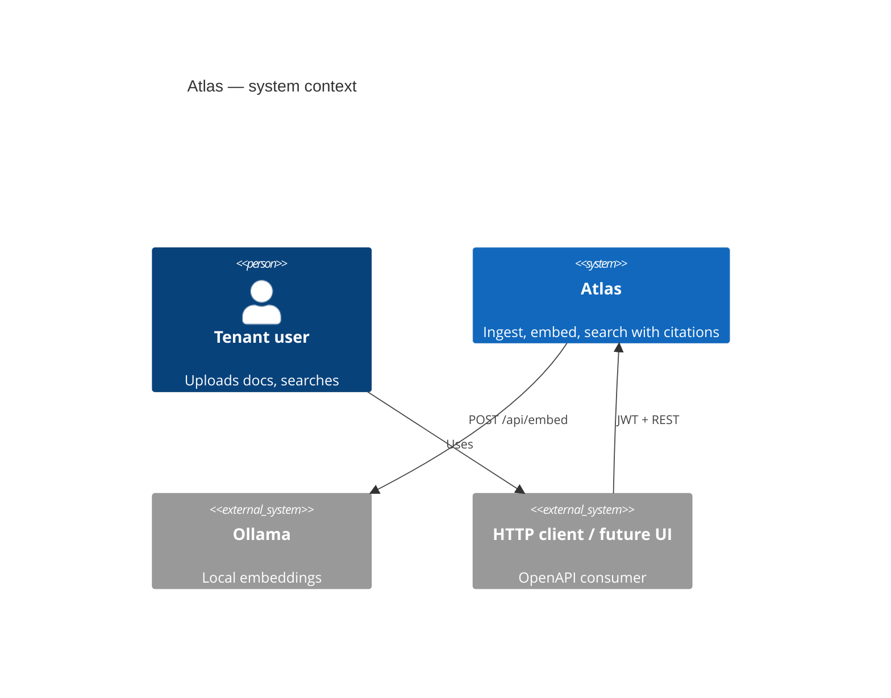
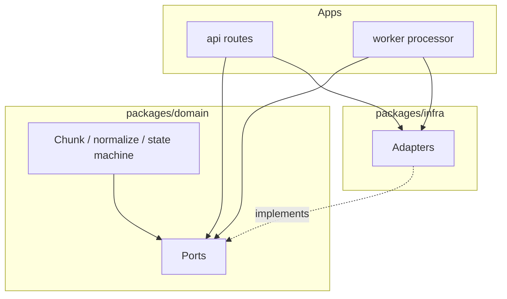

# Architecture overview

Atlas is a **pnpm monorepo** implementing a tenant-scoped knowledge platform:

**API** accepts authenticated uploads and search · **Worker** runs the ingestion pipeline · **Domain** owns ports and pure logic · **Infra** supplies adapters.

## System context

*(Rendered where Mermaid C4 is supported; otherwise see the deployment diagram below.)*

## Logical components

| Component | Package / app | Responsibility |
|-----------|---------------|----------------|
| API | `apps/api` | Auth, upload, jobs, search, health, metrics, OpenAPI |
| Worker | `apps/worker` | Consume ingestion jobs; extract → chunk → embed → index |
| Domain | `packages/domain` | Entities, ports, chunking, normalize, job/document state machine |
| Infra | `packages/infra` | Prisma, S3/MinIO, BullMQ, Ollama, Qdrant, JWT/bcrypt |
| Config | `packages/config` | Zod-validated env |
| Observability | `packages/observability` | Pino, Prometheus, OTel bootstrap + span helpers |
| AppHost | `apphost/` | Aspire control plane only ([ADR 0002](../adr/0002-aspire-as-control-plane-not-framework.md)) |

## Hexagonal boundary

**Invariant:** `packages/domain` must not import `packages/infra`. See [Hexagonal detail](./hexagonal.md) and [ADR 0008](../adr/0008-hexagonal-vertical-slices.md).

## Data stores

| Store | Holds | Why separate |
|-------|-------|--------------|
| **MinIO / S3** | Original bytes | Cheap blob lifecycle; never bloat Postgres ([ADR 0007](../adr/0007-minio-object-storage.md)) |
| **Postgres** | Users, documents, jobs, chunk text | Source of truth for metadata & citations |
| **Redis** | BullMQ queues / DLQ | Durable async work ([ADR 0006](../adr/0006-bullmq-over-rabbitmq.md)) |
| **Qdrant** | Vectors + payload (`tenantId`, ids) | ANN search ([ADR 0010](../adr/0010-why-qdrant.md)) |

## Dual-write compensation

Upload order is intentional:

1. Stream bytes → object store  
2. Write document + job rows  
3. Enqueue BullMQ payload  

If (2) fails after (1), best-effort delete the object. If (3) fails after (2), mark job/document `failed`.

## Related docs

- [AI pipeline](./ai-pipeline.md)
- [Sequence diagrams](./sequence-diagrams.md)
- [Deployment diagram](./deployment.md)
- [Observability](./observability.md)
