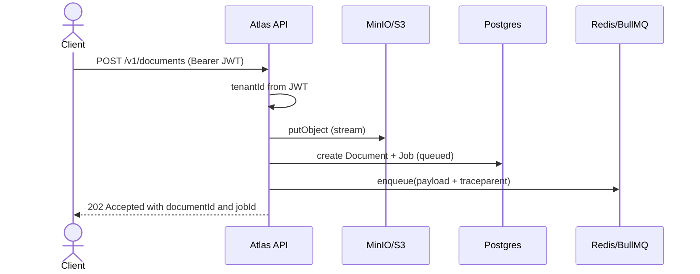
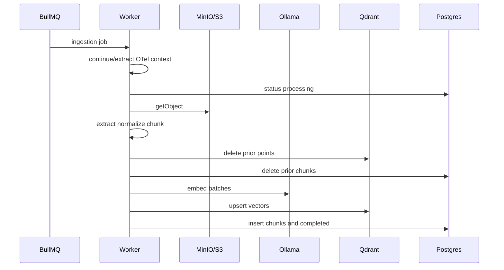
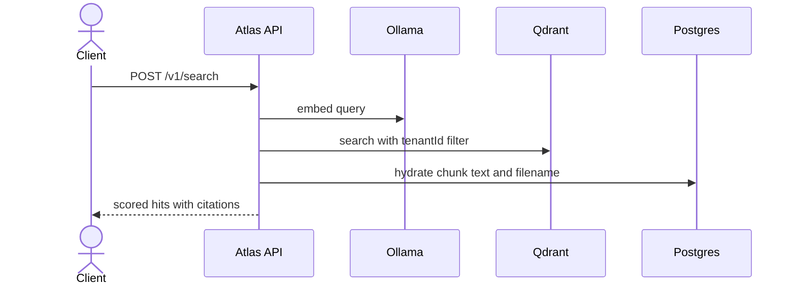
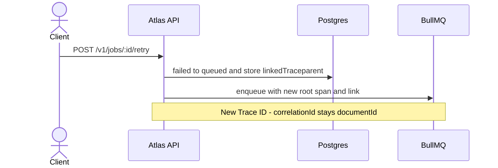

# Sequence diagrams

## Document upload (async accept)

## Ingestion worker

## Semantic search

## Manual job retry (linked trace)

See [ADR 0003](../adr/0003-opentelemetry-w3c-over-vendor-sdks.md) and [ADR 0009](../adr/0009-async-upload-polling.md).
